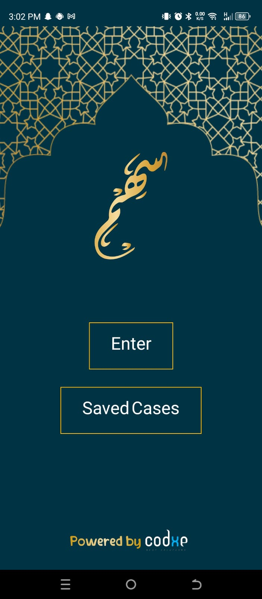
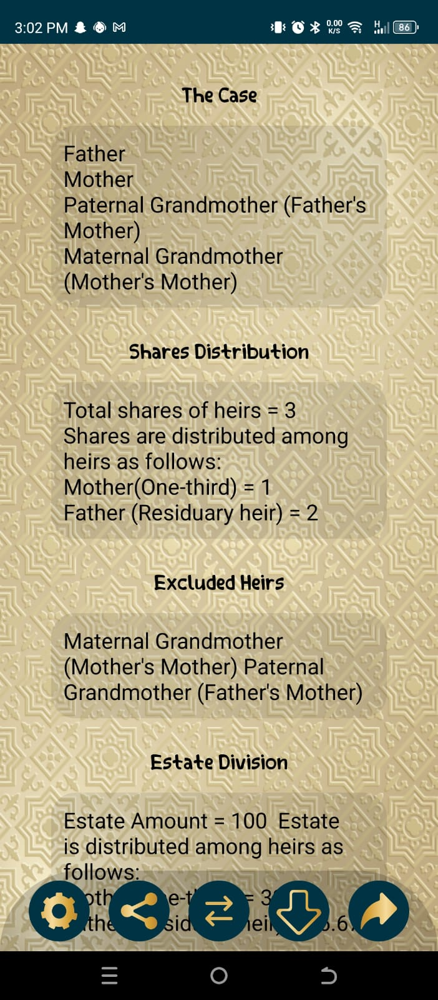
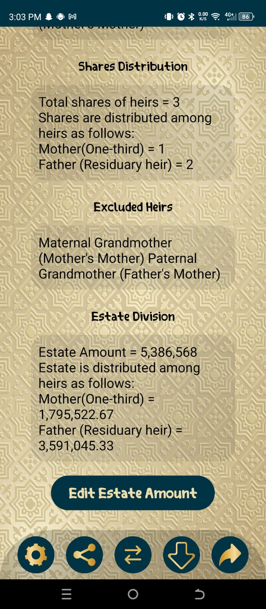
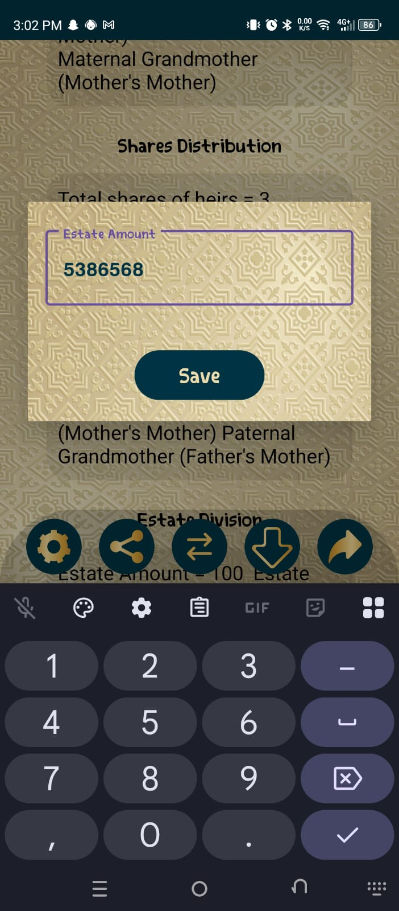
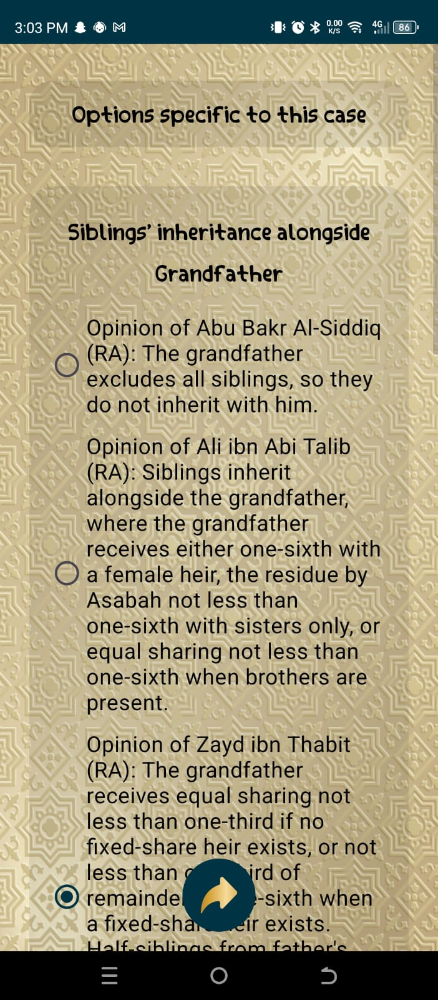

# Sahm App — English Localization

Localized "Sahm" — a published Arabic Islamic Inheritance 
Calculator app (4.7★, 3K+ reviews on Google Play Store) 
to English. Translated complete UI, labels, and content 
while maintaining all functionality and Islamic 
inheritance calculation logic.

## Original App
- Play Store Rating: 4.7★ (3K+ reviews)
- Purpose: Calculate inheritance shares per Islamic law

## My Contribution
- Translated complete UI from Arabic to English
- Maintained all original functionality
- Built and tested English version APK

## Download English Version
APK file available in this repository

## Updated App Screenshots (English Version)

